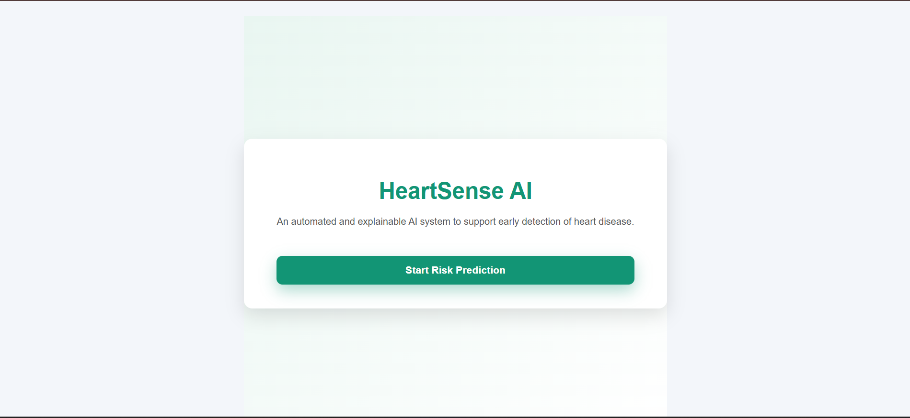

# Heart_Disease_prediction_app

**Abstract**

HeartSense AI is a machine learning–based web application that predicts the risk of heart disease using patient health data. The system is built using a Random Forest Classifier, which is trained on key medical features such as age, gender, blood pressure, cholesterol, heart rate, chest pain type, and exercise-induced angina. The trained model is deployed in a Flask backend, and a simple web interface allows users to input patient details and instantly receive a risk prediction along with a probability score indicating whether the patient is at low, moderate, or high risk. This project demonstrates how AI-driven predictive analytics can support early detection and assist doctors in making informed clinical decisions, while also showing how machine learning models can be integrated into real-world healthcare systems.

Dataset: https://www.kaggle.com/datasets/johnsmith88/heart-disease-dataset

Step By Step Guide to run Heat Sense AI

Step 1: 
First, install Python version 3.8 or higher on the system and verify that Python and pip are correctly configured.

Step 2: 
Create a new project directory named HeartSense-AI to store all backend, model, and frontend files. Inside the project directory, place the Flask application file (app.py), the trained Random Forest model file (heart_model.pkl), and the SHAP explainer file (shap_explainer.pkl). Create a templates folder and add the frontend HTML files (home.html and index.html) required for rendering the user interface. Create a static folder to store CSS and JavaScript files used for styling and client-side logic.

HeartSense-AI/
│
├── app.py
├── heart_model.pkl
├── shap_explainer.pkl
├── requirements.txt
│
├── templates/
│   ├── home.html
│   └── index.html
│
└── static/
    └── CSS/JS files

Step 3:
Create a virtual environment for the project to isolate dependencies from the system Python installation.
python -m venv venv

Activate the virtual environment before installing any project-specific libraries.
venv\Scripts\activate

Step 4:
Install all required Python packages such as Flask, Flask-CORS, pandas, scikit-learn, joblib, and SHAP using pip.

Create requirements.txt with the following content:
flask
flask-cors
pandas
numpy
scikit-learn
joblib
shap

Install dependencies:
pip install -r requirements.txt

Step 5:
Ensure that the trained machine learning model and SHAP explainer were created using the same feature order and feature names expected by the Flask application.

Step 6:
Start the Flask server by running the application file using the Python interpreter.
python app.py

Confirm that the Flask development server starts successfully and listens on the local host at port 5000.
Open a web browser and access the home page of the application through the provided local URL.
Running on http://127.0.0.1:5000/

Navigate to the prediction page where the user interface form allows entry of patient health parameters.
Enter patient details such as age, blood pressure, cholesterol, and chest pain type into the web form.

## Screenshots

### Screenshot 1

### Screenshot 2

### Screenshot 3

